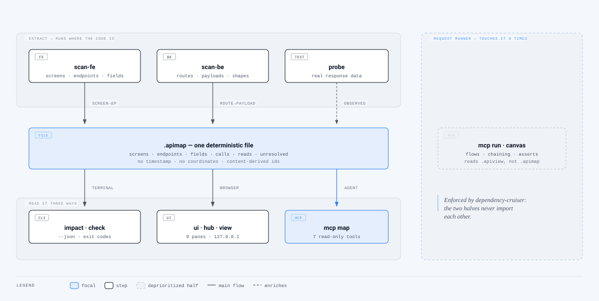

# apiflow

> **Product goal, and what must not be built:** [`NORTH-STAR.md`](./NORTH-STAR.md) — read it before proposing a feature.

**A dependency map for systems that talk over HTTP** — screen ↔ endpoint ↔ field. It answers one
question, before you edit: **if I change this endpoint or this field, which screens break?**

Postman stores requests; it does not know your screens exist. OpenAPI describes the API, not who
consumes it. Grepping a field name returns a thousand lines that cannot tell a definition from a
consumption. Local-first, git-friendly, open source.

[](https://www.npmjs.com/package/@junixlabs/apiflow)
[](LICENSE)



## Quick start

```bash
npm install -g @junixlabs/apiflow                                          # or: npx @junixlabs/apiflow …
apiflow project add "web" --fe=/path/to/frontend [--be=/path/to/api]       # ~1s
apiflow project scan web                                                   # 3s–15s
apiflow ui                                                                 # http://127.0.0.1:3030
```

Nothing is written into the project being scanned — maps live in `~/.apiflow/`
(`APIFLOW_HOME` moves that). One side is enough; `--be` is optional.

From a clone, `node bin/cli.js …` replaces `apiflow …` and needs no build:

```bash
git clone https://github.com/junixlabs/apiflow.git && cd apiflow && npm install   # ~15s
node bin/cli.js --help
```

## Ask

List first, then ask — don't guess an endpoint string.

```bash
MAP=~/.apiflow/projects/web/fe.apimap
apiflow impact $MAP                                  # every endpoint, with caller counts
apiflow impact $MAP --endpoint="GET /users/:id"       # which screens break
apiflow impact $MAP --field=email                     # which screens read this field
apiflow impact $MAP --screen=/users/:id               # what one screen depends on
```

```
## Impact — GET /api/users/{param}

3 screen(s) break if this changes:

- **/users/{param}** [exact] — src/pages/users/[id].tsx:14
  client    fetchUser   src/api/users.ts:8
  ↳ hook      useUser     src/hooks/useUser.ts:12
  ↳ screen    UserPage    src/pages/users/[id].tsx:14
```

Every answer comes with two qualifiers, and both are part of the answer:

| | |
|---|---|
| `exact` | the path is a literal at the call site |
| `inferred` | one half was derived — a template string, an implicit verb |
| `guess` | the path was assembled, or the screen was reached through a wide module hop |
| **unresolved** | call sites the scanner could **not** read. `0 screens` means *nothing in this map calls it* — never *nothing calls it* |

## For an agent

```json
{ "mcpServers": { "apiflow-map": {
  "command": "apiflow", "args": ["mcp", "map"],
  "env": { "APIFLOW_PROJECT": "web" } } } }
```

From a clone, or when the agent's environment has a trimmed `PATH`, spell it out instead:
`"command": "node", "args": ["/path/to/apiflow/bin/cli.js", "mcp", "map"]`.

Seven read-only tools — `impact_endpoint` · `impact_field` · `screen_deps` · `find` · `map_health` ·
`map_check` · `map_list`. Measured on a clean install: 0.4s to connect, 5ms per call. Pair it with
[`skills/apiflow-impact/`](skills/apiflow-impact/), which tells the agent to ask *before* editing a
route, a handler, an api client or a response field.

Two more skills close the loop: [`fe-map-extractor`](skills/fe-map-extractor/) resolves what the
scanner could not read, and [`apiflow-map-audit`](skills/apiflow-map-audit/) samples the map's own
`guess`-level claims and checks them against the code — so "how much can I trust this" gets a
measured answer instead of a label.

## Keep the map honest

```bash
apiflow check $MAP        # exit 0 clean · 1 drifted · 2 cannot check
apiflow check $MAP --write
apiflow project scan web
```

A scan of an unchanged repo is **byte-identical**, and the file records the repo it came from
(`github.com/acme/app//apps/web`) rather than the machine it ran on — so it can be committed,
reviewed in a pull request, and gated in CI.

## What it reads

| Side | Coverage |
|---|---|
| Frontend | framework-agnostic — it reads call sites, not conventions, then walks the import graph back to the screen (`client → hook → component → route`), keeping `file:line` for every hop |
| Backend | Laravel · Strapi · NestJS/Express · Go (gin/chi/echo/fiber) · FastAPI/Flask, plus a generic pass on every file |
| Response shapes | from code (Resource / DTO / `response_model` / struct tags), then **confirmed by running** — the probe harness runs inside the project's own test suite (PHPUnit · vitest+supertest · Go `httptest` · pytest), so it never touches a real database |

## Commands

| Command | What it does |
|---|---|
| `project add \| ls \| scan \| rm` | the workspace registry in `~/.apiflow` |
| `scan-fe <dir>` | frontend → screens, endpoints, fields |
| `scan-be <dir>` | backend → routes, payloads, response shapes |
| `probe <map>` | emit a harness, ingest real responses |
| `link <fe> <be>` | join the two halves |
| `impact <map>` | which screens break — `--endpoint` / `--field` / `--screen`, `--json` |
| `check <map>` | is the map still true — CI gate, `--write` to refresh |
| `ui` · `hub` · `view` | browser UI (live, static workspace, single map) |
| `mcp map` · `mcp run` | MCP servers: read the map (7 tools) · run requests (13 tools) |

`apiflow --help` prints this list. Every command takes `--json` where a machine might read it.

## The other half — running requests

The visual flow runner (canvas, response chaining, assertions, cURL/OpenAPI/Postman import) is the
older half of this repo and is deliberately second in line — see [`NORTH-STAR.md`](./NORTH-STAR.md)
§3 and [`docs/request-runner.md`](docs/request-runner.md).

```bash
npx @junixlabs/apiflow            # canvas + proxy
npm run dev                       # from a clone
```

## Docs

- [Getting started](docs/getting-started.md) — the same path with real output, and what to do when a map looks thin
- [File formats](docs/formats.md) — `.apimap`, `.apiview`, and the `.apiflow` layout
- [Request runner](docs/request-runner.md) — the canvas half, in full
- [`NORTH-STAR.md`](./NORTH-STAR.md) — what this is for, and what will not be built
- [`CHANGELOG.md`](./CHANGELOG.md)

## Contributing

```bash
git clone https://github.com/junixlabs/apiflow.git && cd apiflow && npm install
npm test          # 332 tests
npm run lint
npm run boundary  # the two halves must not import each other
npm run build
```

PRs welcome. Please read the [Code of Conduct](CODE_OF_CONDUCT.md) first.

## License

MIT — see [LICENSE](LICENSE).
